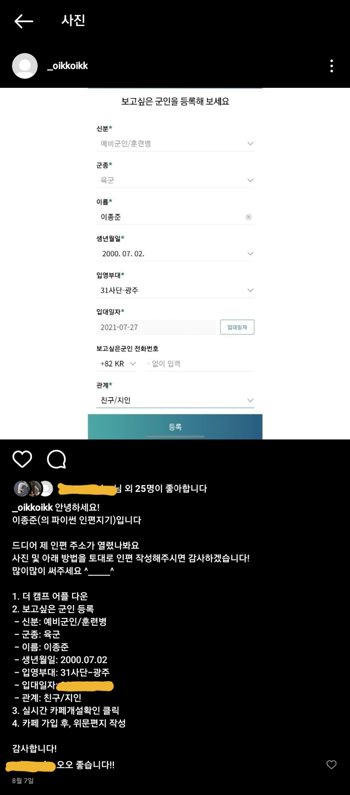
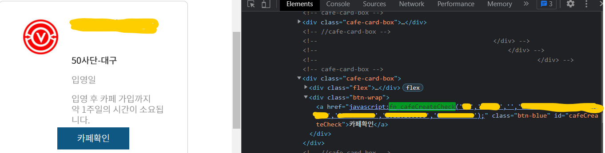

# Instagram_bot for ROKA trainee soldier

## (필자를 포함한) 모든 대한민국 훈련병들을 위한 인스타그램 인편지기입니다.
> Instagram bot for promoting ROKA trainee soldier(just like me)'s consolation letters.

<p align="center"></p>

### 들어가기 (Getting Started)
이 레포지토리는 **윈도우 환경**에 맞춰 제작되었습니다.
**윈도우 작업 스케줄러**에서 ```script.bat``` 파일을 실행시키는 방식으로 제작되었다는 점을 알립니다.

이 레포지토리는 **설치 후 바로 사용할 수 없습니다!**
```userInfo.py```에서 인스타 ID/PW, 더캠프 ID/PW를 직접 설정해주셔야 합니다!

**(인스타에 게시할 사진(```soldier_info.jpg```) 및 문구(```posting_texts.txt```)도 마찬가지입니다!)**

또한, ```main.py```에서는 게시물 사진의 절대경로를, ```script.bat```에서는 작업폴더의 경로를 올바르게 수정해주셔야 합니다 :)


```python
#userInfo.py
class User:
    def __init__(self):
        self.__insta_email = "blahblah@naver.com"
        self.__insta_id = "blahblah@naver.com"
        self.__insta_password = "1234"
        self.__camp_id = "blahblah@naver.com"
        self.__camp_password = "1234"
```
```python
#main.py
# 인스타에 게시할 사진 경로(절대경로)를 작성해주세요!
send_keys('C:\\Users\\ljjun\\Instagram_bot\\soldier_info.jpg')
```
```bat
rem script.bat
@echo off

cd C:\Users\ljjun\Instagram_bot
```
#### 더캠프(THE CAMP) 설정
훈련병의 인편 카페 개설 여부를 확인하기 위해, 더캠프에서 몇 가지 사항을 체크 및 설정해주셔야 합니다.

1. 보고싶은 군인 추가
   - [더캠프](https://www.thecamp.or.kr)에 로그인한 후, **보고싶은 군인**에 훈련병의 인적사항을 입력하여 추가해주시면 됩니다!
  
2. fn_cafeCreateCheck() 검색
   - 보고싶은 군인을 등록한 후, 개발자 모드(f12)에 진입하여 **훈련병의 카페 개설 여부를 확인**하는 fn_cafeCreateCheck()함수 및 parameter를 확인한 후, ```main.py```에 올바르게 변경해주시면 됩니다!
  
  <p align="center"></p>

  ```python
  #main.py
  # "fn_cafeCreateCheck('{any}','이름','입영일자','생년월일','{any}','{any}','{any}')" 형식의 정보를 직접! 더캠프 홈페이지에서 찾으셔야 합니다...!!
FINDING_CAFE_SCRIPT = "fn_cafeCreateCheck('', '이름', '입영일자', '생년월일', '', '', '')"
  ```

#### 준비사항 (Prerequisites)
- **훈련병의 인스타 ID/PW, 더캠프 ID/PW**
- 훈련병의 인스타에 게시할 사진 및 문구
- python3
- selenium
- pywinauto
